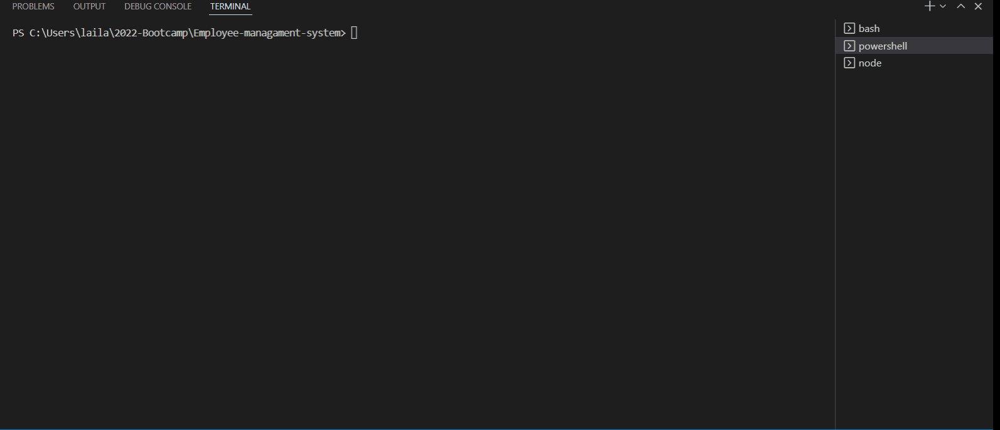

# Employee-managament-system

Developers are often tasked with creating interfaces that make it easy for non-developers to view and interact with information stored in databases. Often these interfaces are known as Content Management Systems. In this homework assignment, your challenge is to architect and build a solution for managing a company's employees using node, inquirer, and MySQL.

# Live URL 

https://sajjazaidi2015.github.io/Employee-managament-system/
-----

## Demonstration 

